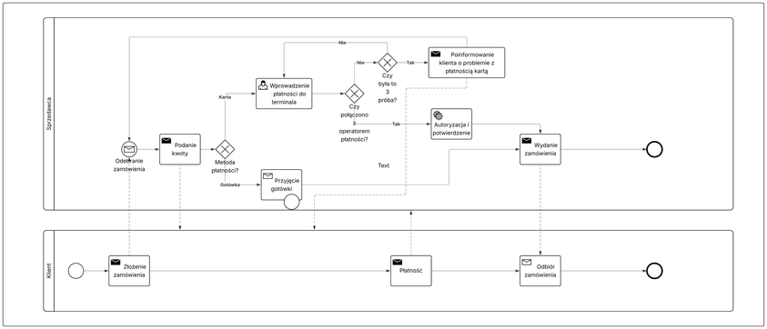
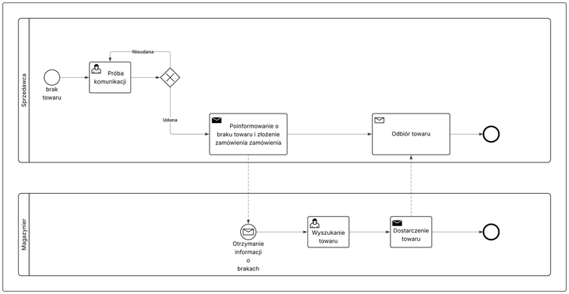

# ZAPYTANIE OFERTOWE NA SYSTEM ZARZĄDZANIA FESTIWALAMI MASOWYMI (GFMS)

## 1. Podstawowe informacje o projekcie

System zarządzania festiwalami masowymi (GlowUp Festival Management System) ma na celu automatyzację i zabezpieczenie procesów związanych z obsługą uczestników oraz logistyką podczas dużych wydarzeń plenerowych. System zastąpi obecne rozwiązania oparte na papierowych biletach (PDF), niestabilnych terminalach płatniczych oraz ręcznym rozliczaniu magazynów (arkusze Excel), wprowadzając nowoczesne rozwiązania cyfrowe z wykorzystaniem technologii NFC, skanerów mobilnych oraz centralnego zarządzania w czasie rzeczywistym.

Zamawiającym jest GlowUp Events Sp. z o.o. (pl. Grunwaldzki 11, Wrocław).

### 1.1 Aktualne działanie systemu

• Proces obsługi festiwalu dzieli się na trzy niepowiązane ze sobą obszary.

**Wejście uczestników:** uczestnicy przychodzą z biletami w formie papierowej lub PDF na telefonie. Ochrona weryfikuje je wzrokowo lub za pomocą prostych skanerów. Powoduje to powstawanie długich kolejek, a w przypadku awarii sieci komórkowej weryfikacja biletów ulega znacznemu spowolnieniu, co zwiększa ryzyko wejścia osób nieuprawnionych.

• **Strefa gastronomiczna:** płatności odbywają się za pomocą gotówki lub standardowych terminali płatniczych. Z powodu obecności kilkudziesięciu tysięcy osób na małym obszarze, sieć komórkowa 4G/5G ulega przeciążeniu. Skutkuje to zrywaniem połączeń w terminalach bankowych, odrzucaniem transakcji i drastycznym wydłużeniem czasu obsługi klienta przy stoiskach. Organizator nie ma wglądu w czasie rzeczywistym w to, jakie są zyski z poszczególnych punktów.

• **Zarządzanie magazynem i zaopatrzeniem:** proces ten opiera się na komunikacji radiowej (krótkofalówki) i ręcznych notatkach. Gdy w danym punkcie gastronomicznym kończy się towar (np. woda), sprzedawca kontaktuje się radiowo z magazynem głównym. Magazynier odszukuje towar, zapisuje wydanie w zeszycie lub arkuszu, a następnie dostarcza go do punktu. Po zakończeniu festiwalu, menedżerowie przez kilka dni ręcznie wprowadzają dane z papierowych raportów i terminali do głównego pliku Excel, aby zbilansować sprzedaż ze stanem magazynowym.

### 1.2 Wymagania

• Jako uczestnik festiwalu, chcę mieć możliwość doładowania konta na opasce NFC przez aplikację mobilną przed i w trakcie wydarzenia, aby uniknąć stania w kolejkach do kas na terenie imprezy i mieć środki od razu gotowe do użycia.

• Jako uczestnik festiwalu, chcę płacić za jedzenie i napoje zbliżając opaskę NFC do terminala na stoisku, aby proces zakupu był błyskawiczny i nie wymagał noszenia gotówki czy kart płatniczych podatnych na kradzież.

• Jako pracownik ochrony na bramce wejściowej, chcę szybko powiązać bilet QR z telefonu uczestnika z czystą opaską NFC za pomocą mobilnego skanera, aby zminimalizować czas obsługi jednej osoby i płynnie rozładować kolejkę przed wejściem.

• Jako pracownik ochrony w strefie VIP, chcę skanować opaski uczestników przy wejściu do stref zastrzeżonych w trybie offline, aby kontrolować uprawnienia dostępu nawet w przypadku całkowitej awarii sieci komórkowej na festiwalu.

• Jako sprzedawca na stoisku gastronomicznym, chcę przyjmować płatności z opasek NFC na terminalu mobilnym działającym w trybie offline (zapis na chip), aby sprzedaż nie była uzależniona od przeciążenia lokalnej sieci internetowej przez dziesiątki tysięcy osób.

• Jako sprzedawca na stoisku gastronomicznym, chcę by system automatycznie generował e-paragon po zbliżeniu opaski przez klienta, aby obsługiwać transakcje zgodnie z przepisami podatkowymi bez konieczności drukowania papierowych rachunków.

• Jako magazynier, chcę skanować kody kreskowe wydawanych beczek z napojami za pomocą przemysłowego skanera mobilnego, aby system automatycznie aktualizował stany magazynowe w czasie rzeczywistym i odpisywał towar z głównego magazynu.

• Jako magazynier, chcę otrzymywać automatyczne powiadomienia na urządzenie mobilne o krytycznych brakach towaru na konkretnych stoiskach, aby płynnie realizować dostawy i unikać przerw w sprzedaży wywołanych brakiem asortymentu.

• Jako menedżer festiwalu, chcę mieć dostęp do panelu webowego z podglądem na żywo na wielkość sprzedaży, liczbę osób na terenie i stany magazynowe, aby móc na bieżąco optymalizować pracę personelu i reagować na sytuacje kryzysowe.

• Jako menedżer finansowy, chcę aby system po zakończeniu festiwalu automatycznie generował zlecenia zwrotu niewykorzystanych środków z opasek na karty bankowe uczestników w ciągu 3 dni, aby uniknąć kosztownego i podatnego na błędy ręcznego procesowania tysięcy przelewów.

• Jako administrator systemu, chcę mieć możliwość integracji przez API z zewnętrznymi operatorami biletowymi (np. Eventim, eBilet), aby automatycznie pobierać bazę sprzedanych biletów i uprawnień przed rozpoczęciem wydarzenia.

### 1.3 Analiza konkurencji

• **Eventim.Inhouse** - Zaawansowany system biletowy i kontroli dostepu. Doskonale radzi sobie z dystrybucja wejsciowek i skanowaniem kodow QR na bramkach. Nie posiada jednak wbudowanego modulu platnosci offline na opaskach NFC oraz nie obsluguje logistyki i gospodarki magazynowej stoisk gastronomicznych na festiwalu.

• **SumUp POS** - Popularny system sprzedazowy z mobilnymi terminalami. Umozliwia platnosci i generowanie paragonow, ale wymaga stabilnego polaczenia z internetem. W przypadku przeciazenia sieci komorkowej przez tlum na festiwalu staje sie bezuzyteczny. Nie obsluguje zamknietego ekosystemu opasek NFC dla uczestnikow.

• **Subiekt nexo PRO** - Potezny polski system ERP do zarzadzania magazynem i sprzedaza. Swietnie sprawdza sie w inwentaryzacji i obsludze skanerow kodow kreskowych, ale jest to rozwiazanie zoptymalizowane pod standardowe firmy handlowe. Brakuje mu mobilnosci polowej, integracji z bramkami wejsciowymi oraz obslugi wirtualnych portfeli uczestnikow festiwalu.

• **Intellitix** - Globalny dostawca systemow cashless dla najwiekszych festiwali. Obsluguje opaski NFC i platnosci w trybie offline. Jest to jednak system zamkniety, ktory ma trudnosci z pelna integracja z polskimi systemami fiskalnymi (e-paragon) oraz nie posiada natywnego, rozbudowanego modulu dla magazynierow do zarzadzania zaopatrzeniem (skanowanie kodow kreskowych beczek i towaru) w czasie rzeczywistym.

### 1.4 Analiza wymagan

| System | Kontrola wejsc offline (NFC) | Platnosci offline (NFC) | Zarzadzanie magazynem (skanery mobilne) | E-paragony i polska fiskalizacja | Automatyczne zwroty srodkow |
|--------|-------------------------------|--------------------------|------------------------------------------|----------------------------------|------------------------------|
| Eventim.Inhouse | Nie | Nie | Nie | Nie | Nie |
| SumUp POS | Nie | Nie | Ograniczone | Tak | Nie |
| Subiekt nexo PRO | Nie | Nie | Tak | Tak | Nie |
| Intellitix | Tak | Tak | Nie | Ograniczone | Tak |

Z powyzszej analizy wynika, ze zaden z gotowych systemow dostepnych na rynku nie obsluguje lacznie: zamknietego obiegu pieniadza offline z zapisem na chip opaski, polskiej fiskalizacji transakcji oraz zaawansowanej logistyki magazynowej z uzyciem mobilnych skanerow dla personelu. W zwiazku z tym konieczne jest stworzenie autorskiego rozwiazania GFMS.

## 2. Opis przedmiotu zapytania

### 2.1 Proponowana architektura systemu

System GFMS składać się będzie z następujących głównych komponentów:

1) Portal webowy dla organizatorów i menedżerów festiwalu  
2) Aplikacja mobilna dla uczestników wydarzenia  
3) Oprogramowanie na terminale mobilne dla ochrony (skanowanie QR i parowanie NFC)  
4) Oprogramowanie na terminale POS dla stoisk gastronomicznych (płatności offline NFC, e-paragony)  
5) Aplikacja magazynowa obsługująca przemysłowe skanery kodów kreskowych  
6) Moduł rozliczeniowy i system automatycznych zwrotów  
7) API do integracji z zewnętrznymi operatorami biletowymi

### 2.2 Zakres prac

Przedmiotem zamówienia jest wykonanie kompleksowego systemu informatycznego obejmującego:

• Zaimplementowanie aplikacji mobilnej dla uczestników umożliwiającej: przypisanie biletu QR, szybkie doładowanie wirtualnego portfela, zastrzeżenie zgubionej opaski oraz podgląd historii transakcji.

• Zaimplementowanie systemu kasowego i kontroli dostępu zawierającego: moduł bezpiecznej obsługi opasek NFC w trybie offline (odczyt i zapis salda bezpośrednio na chipie opaski), obsługę stref VIP oraz wystawianie e-paragonów zgodnie z polskim prawem.

• Zaimplementowanie aplikacji magazynowej obejmującej: wsparcie dla skanowania kodów kreskowych z palet i beczek za pomocą profesjonalnych skanerów, śledzenie zużycia towaru na stoiskach w czasie rzeczywistym oraz system powiadomień o brakach dla zaopatrzeniowców.

• Zaimplementowanie portalu zarządzającego umożliwiającego: podgląd statystyk sprzedażowych i frekwencyjnych na żywo, konfigurację cenników, zarządzanie uprawnieniami personelu oraz masowe generowanie zwrotów po festiwalu.

### 2.3 Wymagania szczegółowe

#### 2.3.1 Portal organizatora

Portal webowy musi spełniać następujące wymagania:

• Interfejs responsywny dostosowany do pracy na komputerach i tabletach w sztabie festiwalu  
• Panel analityczny (dashboard) prezentujący kluczowe wskaźniki (liczba osób, przychód, top stoiska)  
• Moduł centralnego zarządzania asortymentem i cenami przesyłanymi do terminali POS  
• Automatyczne generowanie poleceń zwrotów niewykorzystanych środków na karty bankowe  
• Eksport raportów finansowych i magazynowych do formatów CSV i XLS  
• Rozbudowane zarządzanie poziomami dostępu dla różnych grup pracowników  

#### 2.3.2 System mobilny dla personelu (POS, Ochrona, Magazyn)

Oprogramowanie dla personelu musi spełniać następujące wymagania:

• Kompatybilność z profesjonalnymi urządzeniami z systemem Android (np. terminale POS Sunmi V2 dla barmanów, skanery Zebra dla magazynierów)  
• Bezpieczny zapis i odczyt kryptograficzny na chipach NFC (Mifare DESFire)  
• Pełna funkcjonalność operacyjna w trybie offline z automatyczną synchronizacją w tle po odzyskaniu połączenia sieciowego  
• Błyskawiczne parowanie biletów QR z czystymi opaskami na bramkach wejściowych  
• Powiadomienia push dla logistyki o konieczności dostarczenia towaru do konkretnego punktu  

#### 2.3.3 Aplikacja mobilna uczestnika

Aplikacja musi spełniać następujące wymagania:

• Dostępność na platformy iOS (App Store) i Android (Google Play)  
• Integracja z popularnymi bramkami płatności (Blik, Apple Pay, Google Pay)  
• Wyświetlanie unikalnego kodu QR pełniącego rolę początkowego biletu wstępu  

### 2.4 Wymagania niefunkcjonalne

#### 2.4.1 Wydajność i responsywność

Czas odczytu i zapisu na chipie NFC opaski na bramkach wejściowych oraz w terminalach POS nie może przekraczać 0,5 sekundy. System backendowy musi być w stanie obsłużyć nagłe piki ruchu (np. masowe logowanie 30 000 uczestników jednocześnie do aplikacji w pierwszym dniu festiwalu) bez odczuwalnych opóźnień.

#### 2.4.2 Dostępność i niezawodność (SLA)

Kluczowe moduły polowe (skanery ochrony, terminale barmanów, skanery magazynowe) muszą działać w architekturze offline-first, gwarantując pełną operacyjność przy całkowitym braku dostępu do internetu. Portal webowy dla menedżerów powinien charakteryzować się dostępnością na poziomie 99,9% w skali roku.

#### 2.4.3 Bezpieczeństwo danych

Transmisja danych musi być szyfrowana (standard TLS 1.3). Zapis salda na opaskach uczestników musi wykorzystywać zaawansowane mechanizmy kryptograficzne (np. standard Mifare DESFire), aby wykluczyć możliwość klonowania opasek lub sztucznego podbijania salda. System musi być w pełni zgodny z dyrektywą RODO w zakresie przetwarzania danych osobowych uczestników i historii ich transakcji.

#### 2.4.4 Skalowalność i architektura

Część serwerowa (backend) powinna być oparta na chmurze obliczeniowej z mechanizmem automatycznego skalowania (autoscaling). Pozwoli to zoptymalizować koszty utrzymania serwerów poza sezonem festiwalowym i gwarantować maksymalną stabilność w trakcie trwania samych wydarzeń.

#### 2.4.5 Kompatybilność sprzętowa

Oprogramowanie dla personelu musi działać stabilnie na urządzeniach wbudowanych z systemem Android (w tym na przemysłowych urządzeniach Zebra oraz terminalach płatniczych Sunmi). Aplikacja dla uczestników musi wspierać najpopularniejsze wersje systemów iOS oraz Android, oferując spójne doświadczenie użytkownika (UX) niezależnie od platformy.

### 2.5 Kod CPV

Kody zgodnie ze Wspólnym Słownikiem Zamówień (ang. Common Procurement Vocabulary):

• 48000000-8 Pakiety oprogramowania i systemy informatyczne  
• 48110000-6 Pakiety oprogramowania dla handlu detalicznego (POS)  
• 48430000-1 Pakiety oprogramowania do zarządzania zapasami  
• 48730000-4 Pakiety oprogramowania do zabezpieczania dostępu  

## 3. Warunki udziału w postępowaniu

### 3.1 Wymagania dla Oferentów

Oferent musi spełniać następujące kryteria:

a) Posiadać minimum 8-letnie doświadczenie w realizacji zaawansowanych systemów informatycznych, w tym rozwiązań typu high-load (duże obciążenia ruchu sieciowego).

b) Zrealizować w ciągu ostatnich 3 lat minimum 2 projekty o wartości powyżej 800 000 PLN każdy, związane z systemami płatności (fintech), obsługą wydarzeń masowych lub zamkniętymi systemami cashless.

c) Dysponować zespołem minimum 20 specjalistów (architektów, programistów, testerów, projektantów UI/UX) z udokumentowanym doświadczeniem w technologiach mobilnych oraz komunikacji sprzętowej NFC.

d) Posiadać udokumentowane doświadczenie w integracji oprogramowania z profesjonalnymi terminalami POS (np. Sunmi) oraz przemysłowymi skanerami magazynowymi (np. Zebra).

e) Legitymować się certyfikatem bezpieczeństwa informacji ISO 27001, ze względu na wymóg bezpiecznego przetwarzania danych finansowych i osobowych uczestników festiwalu.

### 3.2 Wykluczenia

Z postępowania wykluczone są podmioty:

• Powiązane kapitałowo lub osobowo z Zamawiającym (GlowUp Events Sp. z o.o.)  
• Znajdujące się w stanie upadłości, likwidacji lub restrukturyzacji  
• Zalegające z opłacaniem podatków do Urzędu Skarbowego lub składek ZUS  
• Które nie spełniają warunków technicznych i zasobowych określonych w punkcie 3.1  

## 4. Kryteria oceny ofert

Ocena ofert zostanie przeprowadzona w oparciu o następujące kryteria:

**Cena 40% :**  
Łączna cena netto realizacji całego systemu GFMS wraz z wdrożeniem i testami obciążeniowymi

**Funkcjonalność i technologia 30%:**  
Zaproponowana architektura i bezpieczeństwo dla trybu offline z wykorzystaniem chipów NFC  
Ergonomia i nowoczesność interfejsów (UX/UI) aplikacji mobilnej dla uczestników oraz portalu webowego

**Doświadczenie 20%:**  
Liczba udokumentowanych wdrożeń systemów biletowych, cashless lub rozwiązań magazynowych  
Przedstawione referencje od poprzednich zamawiających (mile widziana branża eventowa lub e-commerce)

**Termin realizacji 10%:**  
Gwarancja dostarczenia działającej wersji MVP na minimum 6 tygodni przed rozpoczęciem głównego sezonu festiwalowego (maj 2026)  
Harmonogram wdrożenia poszczególnych modułów w metodyce zwinnej (Agile/Scrum)

## 5. Termin i sposób składania ofert

### 5.1 Termin składania ofert

Termin składania ofert: 20.04.2026 godz. 12:00  
Otwarcie ofert: 21.04.2026 godz. 10:00  
Termin związania ofertą: 60 dni

### 5.2 Sposób składania ofert

Oferty należy składać w formie elektronicznej zabezpieczonej hasłem na adres e-mail: przetargi@glowupevents.pl lub w formie papierowej w zamkniętej kopercie na adres siedziby Zamawiającego: pl. Grunwaldzki 11, 50-377 Wrocław.

### 5.3 Zawartość oferty

Oferta musi zawierać:

Dane identyfikacyjne oferenta i aktualny odpis z KRS  
Szczegółową koncepcję techniczną rozwiązania (w tym architekturę dla trybu offline NFC)  
Harmonogram zwinnej realizacji zamówienia z propozycją wdrożenia wersji MVP przed sezonem letnim  
Szczegółowy kosztorys z rozbiciem na poszczególne moduły (aplikacja gości, portal webowy, POS barmana, skaner magazyniera)  
Proponowany skład zespołu realizacyjnego wraz z doświadczeniem kluczowych osób  
Zadeklarowane warunki SLA (Service Level Agreement) i gwarancji  

## 6. Załączniki

Oświadczenie o braku powiązań kapitałowych i osobowych z Zamawiającym  
Wykaz zrealizowanych projektów (portfolio) poparty referencjami  
Wzór umowy wdrożeniowej proponowany przez Oferenta  
Specyfikacja techniczna preferowanego sprzętu docelowego (terminale POS typu Sunmi, przemysłowe skanery Zebra, standard chipów NFC)

## 7. Informacje dodatkowe

### 7.1 Warunki zmiany umowy

Zamawiający przewiduje możliwość zmiany umowy w przypadku:

a) Zmiany przepisów prawa (w szczególności podatkowego dotyczącego e-paragonów i kas fiskalnych) mających wpływ na realizację  
b) Pojawienia się nowych generacji urządzeń sprzętowych wymuszających aktualizację technologiczną  
c) Wystąpienia siły wyższej wpływającej na harmonogram prac  

### 7.2 Prawa autorskie

Wykonawca w ramach wynagrodzenia przekaże Zamawiającemu pełne, wyłączne majątkowe prawa autorskie do:

1. Kodów źródłowych całego systemu GFMS (bez blokad typu vendor lock-in)  
2. Pełnej dokumentacji technicznej, analitycznej i projektowej  
3. Wygenerowanych interfejsów API oraz struktur baz danych  
4. Wszystkich elementów graficznych (UX/UI aplikacji mobilnej oraz portalu webowego)  

### 7.3 Gwarancja i wsparcie (SLA)

Wymagane jest zapewnienie:

1. Minimum 24 miesięcy gwarancji na dostarczone oprogramowanie od momentu odbioru końcowego  
2. Wsparcia technicznego w trybie 24/7 (krytyczne wsparcie On-Call) w trakcie trwania festiwali  
3. Wsparcia w modelu Business Hours 8/5 w okresach poza wydarzeniami  
4. Czasu reakcji na błędy krytyczne (np. awaria parowania opasek lub płatności offline): maksymalnie 2 godziny  
5. Okresowych aktualizacji zabezpieczeń i poprawek wydajnościowych systemu  
